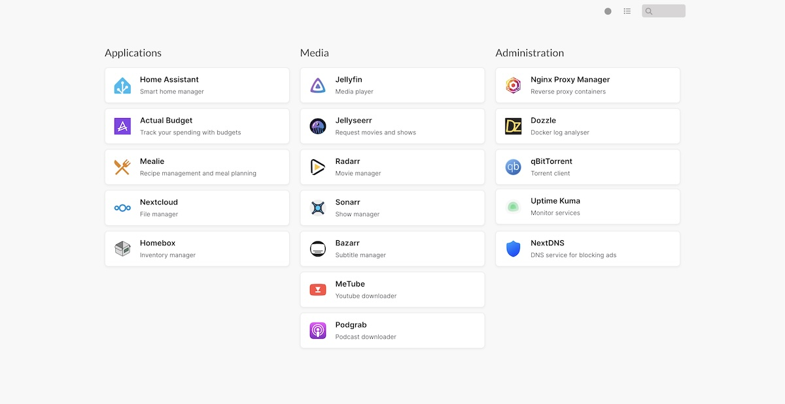

# Homelab with Docker Compose

Collection of Docker Compose files to easily install and manage your homelab. This includes containers I use myself. Feel free to suggest new containers of fork this repository and add your own.

## Included containers

| Applications                                                                                                         | Media                                                                                                        | Administration                                                                                                                 |
|----------------------------------------------------------------------------------------------------------------------|--------------------------------------------------------------------------------------------------------------|--------------------------------------------------------------------------------------------------------------------------------|
|  Home Assistant |  Jellyfin     |  Nginx Proxy Manager |
|  Actual Budget          |  Jellyseerr |  Dozzle                           |
|  Mealie                 |  Prowlarr*    |  qBitTorrent*                |
|  Nextcloud           |  Radarr*        |  Uptime Kuma                 |
|  Homebox               |  Sonarr*        |  Gluetun                         |
|                                                                                                                      |  Bazarr*        |  CloudFlare DDNS              |
|                                                                                                                      |  Readarr*      | FlareSolverr                                                                                                                   |
|                                                                                                                      |  Metube         |                                                                                                                                |
|                                                                                                                      |  Podgrab       |                                                                                                                                |

Disclaimer: these containers are only used for managing legal Linux distro's. 

## Requirements

- [x] Docker and Docker Compose is installed on your system. See [Docker install documentation](https://docs.docker.com/engine/install/)
- [x] Your user has rights to run Docker. See [post-installation steps](https://docs.docker.com/engine/install/)
- [x] Create all required directories used for media storage.

## Folder structure

```
├── /opt
│  └── homelab (this repo)
│     └── homelab-docker (this repo)
|        ├── application folder
│        |  └── .env
│        |  └── docker-compose.yaml
│        |  └── * (config & data)
│        |     └── *
│        ├── .env
│        └── docker-compose.yaml
└── /mnt/storage (media storage)
   ├── nextcloud
   ├── downloads
   │  ├── books
   │  ├── movies
   │  └── tv
   └── media
      ├── books
      ├── movies
      ├── podcasts
      ├── tv
      └── youtube
```

### Change ownership of media storage

```shell
$ sudo chown -R $USER:$USER /mnt/storage
$ sudo chmod -R a=,a+rX,u+w,g+w /mnt/storage
```

## Installation

### Clone this repository

```shell
$ cd /opt
$ git clone https://github.com/shaunjanssens/homelab
```

### Change `.env` files for all containers

Each container has it's own `.env` file with container specific config. Some only have the exposed port, others have more config. Each container contains and `README.md` with more info.

#### Getting user and group ID

By default, Docker containers run as `root`. This entails dangers, that's why most containers run as a non-root user.

```shell
$ id
```

The output of this command should be something like `uid=1000(homelabuser) gid=1000(homelabuser) groups=1000(homelabuser),4(adm),24(cdrom),27(sudo),30(dip),46(plugdev),105(lxd),994(docker)` when `1000` is your user and group id and `994` your Docker group.

### Create a shared network

```shell
$ docker network create -d bridge web
```

### Start all containers

```shell
$ docker compose up -d
```

## Accessing containers

It's possible to access all apps with the server IP and container port but Nginx Proxy Manager is included to access the containers with a user-friendly domain. Cloudflare DDNS is also included to update your domains with your IP address. With Cloudflare it's possible to proxy all traffic so your IP address is not exposed.

## Dashboard

To get an overview of all containers there's a dashboard (homer) included. This dashboard needs some configuration to view all containers. There's also a custom theme included. [dashboard-icons](https://github.com/walkxcode/dashboard-icons) is used for app icons but it's also possible to use own images.



## Recommendations

### Docker management

This repository doesn't have a web interface for managing Docker containers. If you do want a management tool then I can recommend [LazyDocker](https://github.com/jesseduffield/lazydocker).

## Roadmap

- [ ] Change Cloudflare DDNS with [hotio/cloudflareddns](https://hotio.dev/containers/cloudflareddns/)
- [ ] Add simple backup solution like [Duplicati](https://docs.linuxserver.io/images/docker-duplicati/)
- [ ] Change [linuxserver/qbittorrent](https://docs.linuxserver.io/images/docker-qbittorrent/) with [hotio/qbittorrent](https://hotio.dev/containers/qbittorrent/) because it comes with a nicer UI
- [ ] Add [Diun](https://crazymax.dev/diun/) for getting notifications when a Docker image is updated